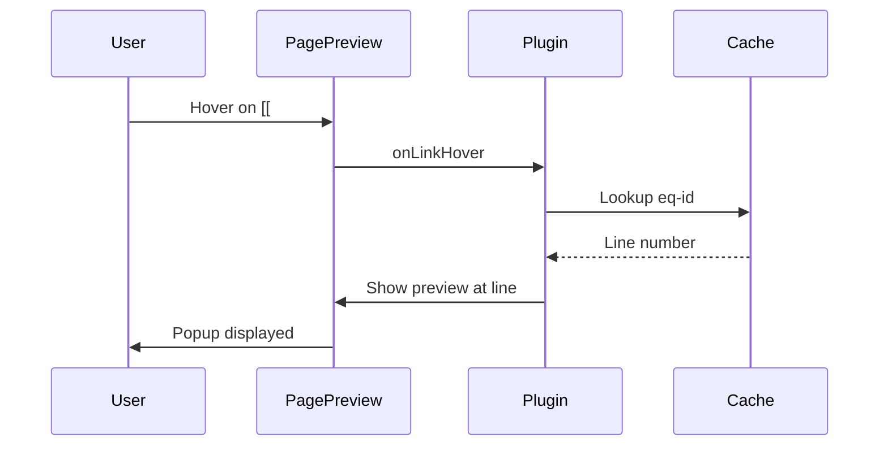

# Quick Preview

Hover over equation links to see a rendered preview popup.

## Overview

When you hover over an equation reference like `[[#^eq-einstein]]`, a popup appears showing:

- The rendered equation
- Context around the equation

This uses Obsidian's built-in Page Preview plugin, enhanced to work with equation block references.

## How It Works

The plugin patches Obsidian's `page-preview` internal plugin to:

1. Detect equation links (format: `[[#^eq-xxx]]`)
2. Look up the equation in the cache
3. Scroll the preview to the correct line

## Requirements

The Page Preview core plugin must be enabled:

1. **Settings** → **Core plugins**
2. Enable **Page preview**

If disabled, the plugin logs a message and hover previews won't work.

## Preview Content

The popup shows the full note context around the equation, similar to hovering over any Obsidian internal link. The equation is scrolled into view automatically.

## Autocomplete Preview

When using the `\eqref` autocomplete:

- Hover over suggestions to preview equations
- Uses the same preview system
- Works in both search modal and editor suggest

## Configuration

No additional configuration needed. The feature works automatically when:

- Page Preview core plugin is enabled
- Equations have valid `% id: eq-xxx` comments
- Equation cache is up to date

## Troubleshooting

| Issue | Solution |
|-------|----------|
| No popup appears | Enable Page Preview core plugin |
| Wrong content shown | Equation cache may be stale, edit the file to refresh |
| Preview doesn't scroll | Equation ID may be malformed |
