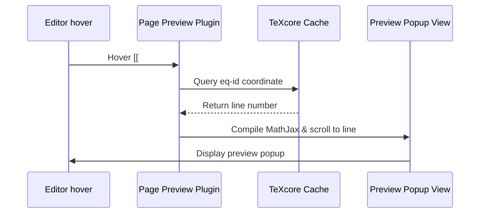

# Quick Hover Previews

TeXcore integrates with Obsidian's core page preview mechanics to display real-time, mathematical popups whenever you hover over an equation link like `[[#^eq-einstein]]` or highlight items in the [Autocomplete Suggestions Menu](search.md).

---

## Technical Architecture

The preview lookup hooks into Obsidian's internal `page-preview` engine. TeXcore intercepts link hover events, references the identifier against the active document's equation cache, locates the line offset, and scrolls the popup container to display the equation in focus.

---

## Requirements & Setup

!!! important "Enable Core Page Preview"
    This feature relies on Obsidian's core architecture. Open **Settings** → **Core plugins** and toggle **Page preview** to **Enable**. If this core dependency is deactivated, TeXcore will log a console warning and hover previews will fallback to standard text previews without viewport scrolling.

---

## Troubleshooting Previews

If preview boxes fail to load or scroll incorrectly, consult the diagnostic table below:

| Symptom | Cause | Solution |
| :--- | :--- | :--- |
| **No preview modal opens** | Page Preview core plugin is toggled off. | Toggle on Page Preview in Obsidian settings. |
| **Formula text displays raw LaTeX** | MathJax rendering is disabled for suggestions. | Toggle on [Render Math in Suggestions](configuration/settings.md#render-math-in-suggestions). |
| **Preview focuses the wrong line** | Malformed `% id: eq-name` or stale index cache. | Touch-edit the note content to trigger a cache re-index. |
