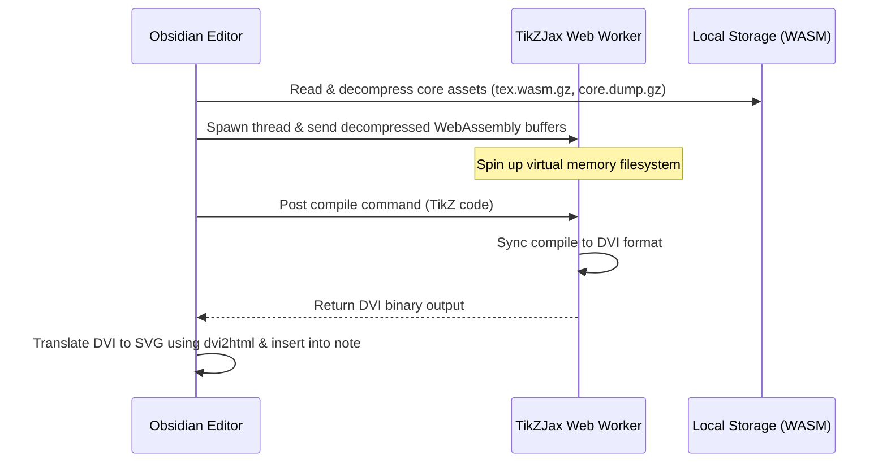

# TikZ Diagrams & Graphical Editor

TeXcore integrates an offline, background-compiled TikZ vector graphics renderer and a fully interactive **TikZ Graphical Editor**. You can write standard LaTeX TikZ scripts directly inside code blocks or edit them visually using a drag-and-drop CAD-like interface.

---

## Architecture & Worker Compilation

To prevent Obsidian UI freezes during heavy TeX compilations, TeXcore utilizes a decoupled **Web Worker Compiler** that operates fully offline:



---

## Editor Workflows

=== "Using Code Blocks"
    Create a code block in your markdown document and identify it with `tikz`. You can include packages like `pgfplots` or libraries in the preamble:
    
    ```tikz
    \usepackage{pgfplots}
    \begin{document}
    \begin{tikzpicture}
      \begin{axis}[xlabel=$x$, ylabel=$y$]
        \addplot[color=red,mark=x] coordinates {
          (2,-3) (3,5) (4,7)
        };
      \end{axis}
    \end{tikzpicture}
    \end{document}
    ```

=== "Using the Graphical Editor"
    1. Click the **Edit visually** button on any rendered TikZ SVG block, or use the Command Palette (++ctrl+p++ → `Insert display math` or search for the TikZ Editor commands).
    2. A CAD-style modal opens:
        - **Left Sidebar**: Component library featuring core shapes (lines, circles, rectangles) and package modules.
        - **Center Canvas**: Interactive grid with zoom (++ctrl+scroll++), panning (++spacebar+drag++), and snapping (toggle via ++g++ or ++h++).
        - **Right Sidebar**: Property editor (adjust color, bold, italics, font size, stroke thickness) and raw TikZ Code synchronization.
    3. Press ++ctrl+z++ to undo and ++ctrl+y++ to redo actions. 
    4. Click the **Update block** button to compile and insert the code block into your note.

---

## Component Package Manager

For complex diagrams (like circuits or flowcharts), the Graphical Editor features a **Component Package Manager** accessed via the footer button in the Left Sidebar.

!!! info "Package Installation Flow"
    Click **Manage Packages** and search for libraries like `circuitikz`. Installing a package decompresses and caches its TeX dependency files (`.tex`/`.sty`) in memory, dynamically expanding your visual element sidebar with custom shapes (e.g. resistors, logic gates, operational amplifiers) that can be drag-dropped onto the grid canvas.

---

## Diagnostics & Troubleshooting

!!! warning "Common TikZ Compilation Hurdles"
    - **Empty Container / Failed rendering**: Verify that the `tikzjax-assets` folder exists inside your plugin installation directory: `.obsidian/plugins/TeXcore/tikzjax-assets/`.
    - **Package Not Found Error**: Double-check spelling inside your block preamble. Only packages included in the asset registry are available offline.
    - **Canvas Panning Locked**: Ensure you hold down the ++spacebar++ while dragging on the canvas container to pan the grid layout.
    - **Compilation Timed Out**: Avoid infinite loops or extremely dense coordinate calculations that exceed WebAssembly heap size allocations.
