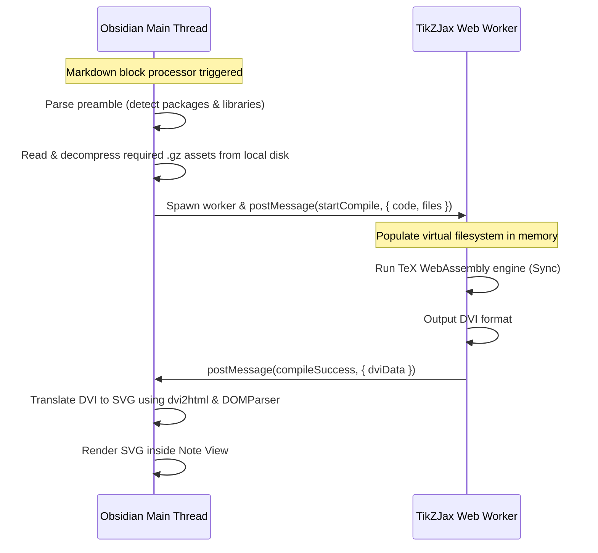

# TikZ Diagrams

Render LaTeX TikZ diagrams (` ```tikz `) fully offline and on-demand inside your notes.

## Overview

Unlike other plugins that require an internet connection to fetch heavy dependencies or freeze your UI during TeX compilation, this plugin leverages a decoupled, worker-based compiler.

- **Fully Offline** — Requires no internet connection. All TeX format files and packages are cached locally in the plugin folder.
- **Lazy Loaded Assets** — Core components (`tex.wasm.gz` and `core.dump.gz`) are read from disk, decompressed, and cached in memory on the first compile. Supplementary packages and libraries (like `circuitikz`, `pgfplots`, or `tikz-cd`) are only loaded and decompressed from disk when requested in your TikZ block's preamble.
- **Web Worker Concurrency** — TeX compilation is CPU-bound. Offloading it to a background Web Worker ensures your Obsidian interface remains smooth and responsive.
- **Theme Integration** — Hardcoded dark strokes and fills adapt automatically to Obsidian's active dark or light themes if dark-mode color inversion is enabled.

---

## How It Works

1. The Markdown code block processor detects a ` ```tikz ` block.
2. The plugin parses the code preamble for package requirements (e.g. `\usepackage{pgfplots}` or `\usetikzlibrary{calc}`).
3. The main thread loads the WASM engine, core dump, and resolved package files, decompresses them natively using Node's `zlib` library, and transfers the buffers to the Web Worker.
4. The background worker spins up a virtual filesystem in memory, loads the TeX format dump, and compiles the TikZ block to a binary DVI format.
5. The main thread receives the DVI binary, translates it to SVG using `dvi2html` and the secure browser `DOMParser` API, and inserts it into the note.



---

## Usage

Create a code block in your markdown document and identify it with `tikz`. You can include packages in the preamble:

```tikz
\usepackage{pgfplots}
\begin{document}
\begin{tikzpicture}
  \begin{axis}[
    xlabel=$x$,
    ylabel=$y$
  ]
    \addplot[color=red,mark=x] coordinates {
      (2,-3)
      (3,5)
      (4,7)
    };
  \end{axis}
\end{tikzpicture}
\end{document}
```

---

## Asset Origins & Lineage

The lazy-loaded assets stored inside the `tikzjax-assets` folder are compiled/extracted from:

1. **[kisonecat/tikzjax](https://github.com/kisonecat/tikzjax)**: The original browser-based TeX compiler created by Jim Fowler, which compiles TeX's Pascal source to WebAssembly via `web2js`.
2. **[drgrice1/tikzjax](https://github.com/drgrice1/tikzjax)**: Glenn Rice's fork which introduced Web Worker support and support for additional LaTeX packages and libraries.
3. **[artisticat1/obsidian-tikzjax](https://github.com/artisticat1/obsidian-tikzjax)**: The Obsidian plugin wrapper created by `artisticat1` which packaged these components for offline usage in Obsidian.

---

## Troubleshooting

| Issue | Cause | Solution |
|-------|-------|----------|
| **Diagram shows empty container** | Core assets are missing or disabled | Ensure the `tikzjax-assets` folder is present inside the plugin directory under `.obsidian/plugins/TeXcore/tikzjax-assets/`. |
| **Error: Package not found** | The requested LaTeX package is not supported or not present | Only packages and libraries pre-compiled into the assets are supported. Ensure the package name matches standard packages (like `pgfplots`, `circuitikz`, `chemfig`, `tikz-cd`). |
| **Compile hangs or freezes** | Complex intersections or recursive computations exceed WebAssembly boundaries | Break down complex calculations or verify diagram logic for syntax loops. |
