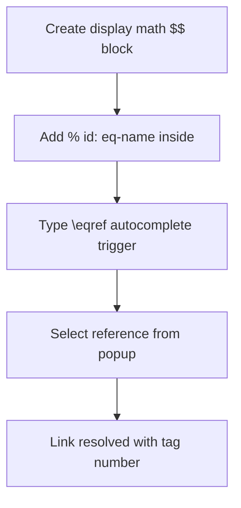

# Getting Started with TeXcore

Follow this guide to install, configure, and draft your first indexed equations in Obsidian.

---

## Installation

You can install TeXcore either directly from the official Obsidian Community Plugins store or manually by compiling the releases.

=== "Community Store (Recommended)"
    1. Navigate to ++ctrl+comma++ (or ++cmd+comma++ on macOS) to open **Obsidian Settings** and select **Community plugins**.
    2. Click **Browse**, search for `TeXcore`, and click **Install**.
    3. Once installed, click **Enable** to activate the plugin.

=== "Manual Installation"
    1. Download the latest `main.js`, `manifest.json`, and `styles.css` from the [Latest Releases](https://github.com/YouFoundJK/TeXcore/releases).
    2. Open your Obsidian Vault directory and navigate to the hidden directory: `.obsidian/plugins/`.
    3. Create a folder named `TeXcore` and paste the three downloaded files into it.
    4. Go to **Settings** → **Community plugins** and toggle TeXcore to **Enable**.

---

## Step-by-Step Setup

Let's write, trigger, and link your first math reference.



### 1. Write the Math Block
Open any note in your vault and create a standard display math block:
```latex
$$
\int_0^\infty e^{-x^2} dx = \frac{\sqrt{\pi}}{2}
$$
```

### 2. Add the Identifier
To index the equation, insert a LaTeX comment (`% id: <name>`) on the line immediately preceding the closing `$$` delimiter:
```latex
$$
\int_0^\infty e^{-x^2} dx = \frac{\sqrt{\pi}}{2}
% id: eq-gaussian
$$
```
!!! tip "ID Format Constraints"
    Your identifier must start with `eq-` followed by letters, numbers, or hyphens. Examples: `eq-gaussian`, `eq-step-1`, or `eq-ref-3`.

### 3. Insert the Reference
Type `\eqref` (the default trigger) in your text. An autocomplete dropdown listing all active note equations will pop up. Select `eq-gaussian` and press ++enter++ to insert `[[#^eq-gaussian]]`.

```markdown
The integral [[#^eq-gaussian]] resolves to a constant.
```

### 4. Observe the Rendered Result
Obsidian will now display a right-aligned number tag `(1)` next to the equation, and the inline link will render as clickable text displaying `(1)`. Hovering over it displays a rich popup preview of the math block.

---

## Interactive Command Palette Actions

Press ++ctrl+p++ (or ++cmd+p++) to trigger the command palette. TeXcore exposes several key commands:

| Command | Action Description | Core Feature Link |
| :--- | :--- | :--- |
| `Insert display math` | Inserts a template display math block containing the `% id:` line. | [Equations](features/equations.md) |
| `Search equations in active note` | Opens the search modal to browse all equation cache references. | [Search](features/search.md) |
| `Fix callout equations in active note` | Fixes missing or misaligned callout markers on math blocks. | [Callouts](features/callout-support.md) |
| `Export current file to PDF` | Opens the PDF compilation window with preview and print settings. | [PDF Export](features/pdf-export.md) |
| `Insert LaTeX Snippet` | Displays saved snippets for fast editor insertion. | [Snippets](features/snippets.md) |

For further customization, consult our [Settings Reference](configuration/settings.md) or explore the [Features Matrix Overview](features/index.md) to see what is possible.
